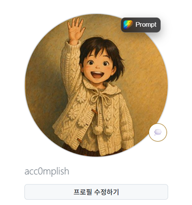
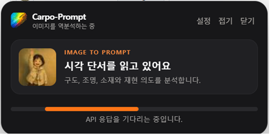
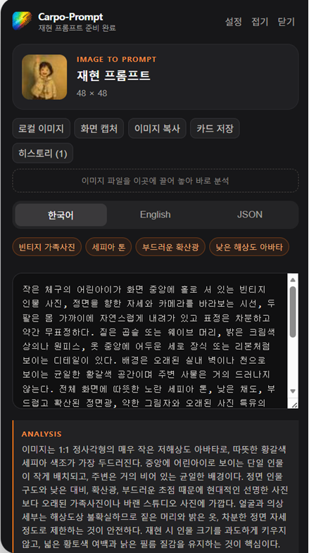
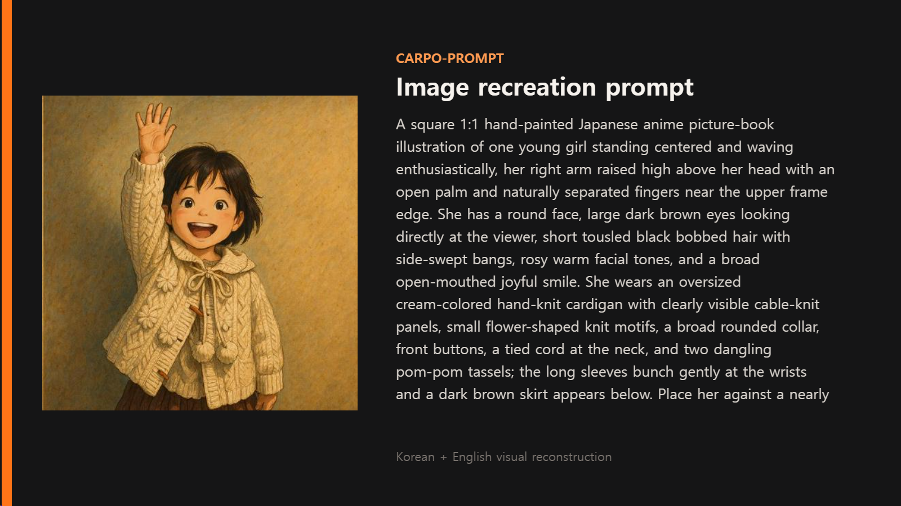

# Carpo-Prompt

> A Chrome (Manifest V3) extension that turns a web image into Korean and English image-generation prompts using your own OpenAI-compatible vision API.

[한국어 문서 보기](./README.ko.md)

## Screenshots

| Hover button | Analyzing | Result | Share card |
| :---: | :---: | :---: | :---: |
|  |  |  |  |

## Supported vision models (current)

Works with any OpenAI-compatible `/chat/completions` vision endpoint. Currently used / tested with:

- **ChatGPT 5.6** (`gpt-5.6`) — OpenAI
- **Gemini 3.6** (`gemini-3.6`) — Google
- **GLM 5.2** (`glm-5.2`) — Zhipu / z.ai
- **Claude 5** — via an OpenAI-compatible gateway (Custom provider)

## Install locally

1. Open `chrome://extensions` and enable **Developer mode**.
2. Choose **Load unpacked** and select this project directory.
3. Open the Carpo-Prompt popup, pick a **Provider** (OpenAI, Gemini, GLM-5V, or Custom), and save the Base URL, API key, and a vision model name:
   - OpenAI — `https://api.openai.com/v1`, model `gpt-5.6` (not the image-generation model).
   - Gemini — `https://generativelanguage.googleapis.com/v1beta/openai`, model `gemini-3.6`.
   - GLM-5V — `https://api.z.ai/api/paas/v4`, model `glm-5.2`.
   - Custom — any OpenAI-compatible `/chat/completions` endpoint, including a Claude 5 gateway.
4. Hover a web image (Prompt button), open the panel from the toolbar (**패널 열기**), or right-click an image/link and choose **Carpo-Prompt로 이미지 분석**.

## What it does

- Sends the image and a visual-forensics prompt to `{baseUrl}/chat/completions`.
- Image hover button, toolbar **패널 열기**, page-level largest-image selection, right-click context menu, and a movable/minimizable in-page result card.
- Local image files, drag-and-drop into the panel, and a selectable visible-page screenshot.
- Editable Korean, English, and structured JSON output; prompt drafts saved in local history.
- Copy prompts and source images, export a PNG prompt card, and open/autofill ChatGPT Images, Grok Imagine, Gemini, Midjourney, Adobe Firefly, or Qwen Image 3.0.
- Provider quirks handled: Gemini JSON-mode + reasoning-off, GLM thinking-disable, image re-encoding (WebP/GIF → JPEG), JSON repair, language-bucket repair, 180-second timeout.

## Privacy

The API key is held in `chrome.storage.local` for this browser profile only. It is never placed in page DOM and is sent only to the HTTPS endpoint you configure. Carpo-Prompt blocks localhost/private-network image URLs, requires a short-lived user-action capability for analysis/capture/export, and does not run on selected account, payment, or exchange domains.
